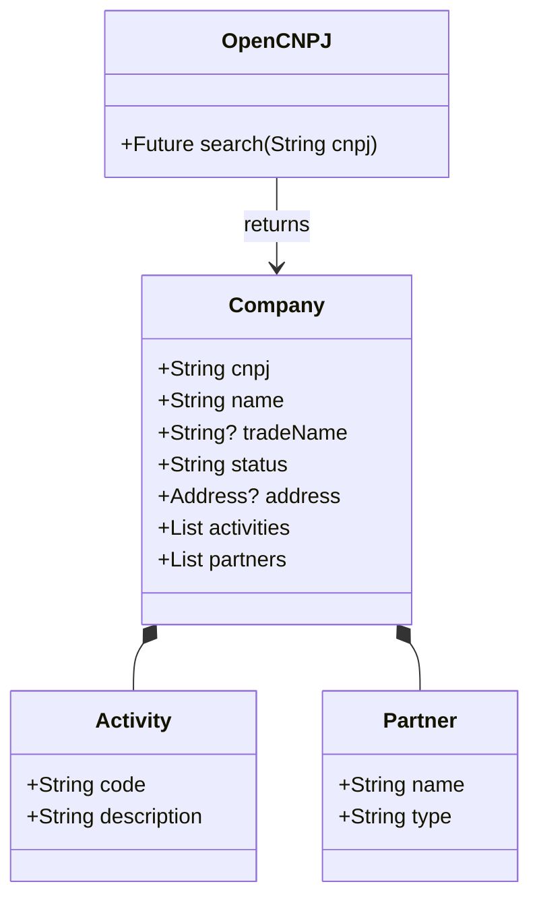

# Design Document - OpenCNPJ Dart Wrapper

## 1. Overview
The `opencnpj` package is a pure Dart library designed to provide a simple, strongly-typed interface for the [OpenCNPJ API](https://opencnpj.org/). It allows developers to retrieve detailed information about Brazilian companies using their CNPJ (Cadastro Nacional da Pessoa Jurídica).

## 2. Goal & Problem Analysis
### Goal
To simplify the integration of Brazilian corporate data into Dart and Flutter applications by abstracting the HTTP layer and JSON parsing of the OpenCNPJ API.

### Problem
Developers currently need to:
1. Manually handle HTTP requests to `https://api.opencnpj.org`.
2. Parse raw JSON responses.
3. Handle specific error codes (404, 500, etc.) manually.
4. Sanitize CNPJ strings (removing formatting like `.`, `/`, `-`).

### Solution
A dedicated package that:
- Provides a singleton or instantiable client.
- Validates inputs before network calls.
- Returns strongly-typed Dart objects.
- Throws semantic exceptions for errors.

## 3. Architecture & Design

### 3.1. Core Components

#### Client (`OpenCNPJ`)
The main entry point. It can be instantiated with an optional HTTP client (for testing) and configuration.

#### Models (DTOs)
Immutable Dart classes representing the API response. Generated using `json_serializable` to ensure robustness.

*   `Company`: Root object containing all details.
*   `Activity`: Represents Primary and Secondary CNAEs.
*   `Partner`: Represents the QSA (Quadro de Sócios e Administradores).
*   `Phone`: Represents phone contact details.

#### Error Handling
Custom exceptions to allow consumers to react to specific failures:
*   `InvalidCNPJException`: Thrown when the input format is incorrect.
*   `NotFoundException`: Thrown when the API returns 404.
*   `OpenCNPJException`: General wrapper for other API or network errors.

### 3.2. Interface Definition

```dart
abstract class IOpenCNPJ {
  /// Fetches company data by CNPJ.
  /// 
  /// [cnpj] can be formatted (00.000.000/0000-00) or unformatted.
  /// Throws [InvalidCNPJException] if format is bad.
  /// Throws [NotFoundException] if company doesn't exist.
  Future<Company> search(String cnpj);
}
```

### 3.3. Data Structure (Simplified)



### 3.4. Dependencies
*   `http`: ^1.0.0 - Standard package for network requests.
*   `json_annotation`: ^4.8.0 - For defining JSON schema.
*   `equatable`: ^2.0.5 - (Optional) For value equality in models, helps with testing.

**Dev Dependencies:**
*   `build_runner`: For generating serialization code.
*   `json_serializable`: For generating serialization code.
*   `mocktail` or `mockito`: For unit testing.
*   `lints`: Official Dart lint rules.

## 4. Implementation Details

### JSON Mapping Strategy
The API returns keys in `snake_case` (e.g., `razao_social`, `situacao_cadastral`). The Dart models will use `camelCase` (e.g., `legalName`, `registrationStatus`) and use `@JsonKey(name: '...')` to map them.

### Input Sanitization
The `search` method will strip non-numeric characters from the input string to ensure compatibility with the API URL structure.

Example:
Input: `06.990.590/0001-23` -> Sanitized: `06990590000123`

## 5. Alternatives Considered
*   **Static only methods:** Rejected. Harder to mock/test for consumers.
*   **Returning generic `Map<String, dynamic>`:** Rejected. Defeats the purpose of a wrapper; type safety is a priority.
*   **Flutter-dependent package:** Rejected. The logic is pure Dart and should be reusable in CLI or Server-side Dart (e.g., shelf, dart_frog).

## 6. References
*   [OpenCNPJ Documentation](https://opencnpj.org/)
*   [Dart HTTP Package](https://pub.dev/packages/http)
*   [Effective Dart: Style](https://dart.dev/effective-dart/style)
